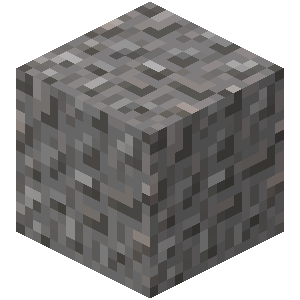

  
  
  
  
  
  
  
  
  
  
  
  
  

<h1 align="center">gRAVEL: (great) <strong>RA</strong>dar <strong>V</strong>elocity <strong>E</strong>nhanced <strong>L</strong>iDAR</h1>

The (**G**reat) **RA**dar **V**elocity **E**nhanced **L**iDAR project aims to combine FMCW Radar with LiDAR to create high-quality FMCW LiDAR-like point cloud data with position and velocity information.

  
  
  
  
  
  
  
  
  
  
  
  
  

